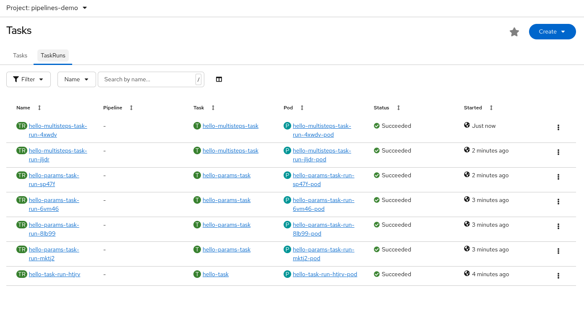
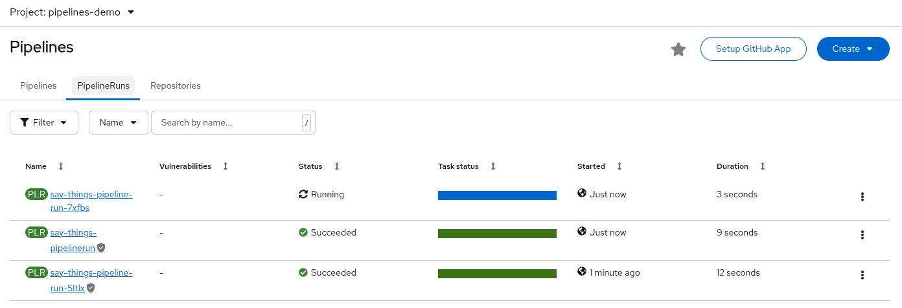
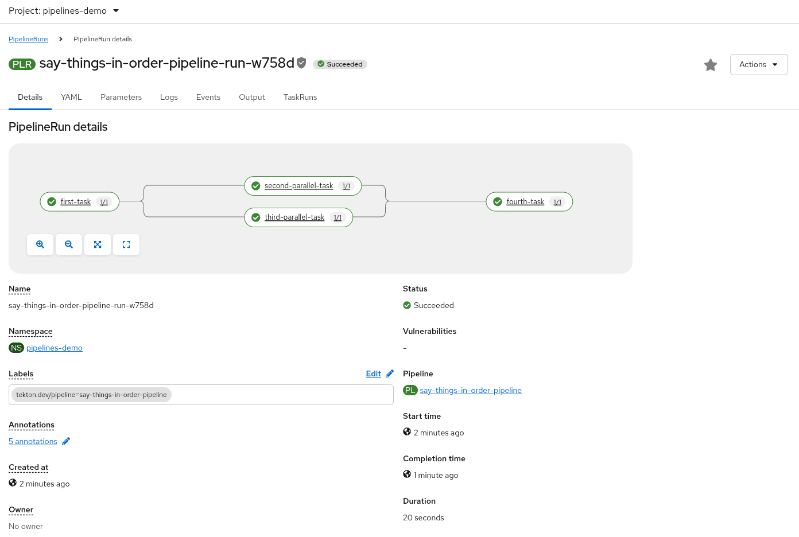

# Red Hat OpenShift Pipelines

This is a sample tutorial that shows the main capabilities of Red Hat
OpenShift Pipelines (based on [Tekton](https://tekton.dev/)).

This tutorial walks through the main components of this new way to
define CI/CD pipelines.

To follow it, the following requirements must be met:

* Red Hat OpenShift 4.20
* Red Hat OpenShift Pipelines Operator 1.20.0
* [Tekton CLI](https://github.com/tektoncd/cli) (`tkn`)

If you don't have access to a Red Hat OpenShift cluster, you could use
[CRC - CodeReady Containers](https://github.com/crc-org/crc) to have
OpenShift 4 on your laptop. Another alternative is to use the [Developer Sandbox](https://developers.redhat.com/developer-sandbox)
by Red Hat Developer program.

**TIP**: Create a new project (e.g., `pipelines-demo`) to follow this repo:

```bash
oc new-project pipelines-demo
```

## Pipelines Operator

**NOTE**: If you are using a shared environment, such as Developer Sandbox, the operator may
already be available. So you can skip this step.

**UPGRADE NOTE**: If you are upgrading from OpenShift Pipelines 1.15 or earlier versions, you may
need to upgrade through intermediate versions (e.g., 1.15 → 1.16 → 1.17 → ... → 1.20) due to
missing `olm.skipRange` metadata in some versions. Direct upgrades may fail in certain cases.

To use OpenShift Pipelines, you need to install the operator in the platform, if it
is not already installed. To deploy an OpenShift Operator, a `cluster-admin` user is needed.

To deploy the operator with a `cluster-admin` user in the `openshift-operators` namespace
(default namespace to install operators in OpenShift):

```bash
oc apply -f 00-pipelines-subscription.yaml -n openshift-operators
```

To check the deployment status:

```bash
❯ oc get csv -n openshift-operators
NAME                                      DISPLAY                         VERSION   REPLACES                                  PHASE
openshift-pipelines-operator-rh.v1.20.2   Red Hat OpenShift Pipelines      1.20.2   openshift-pipelines-operator-rh.v1.20.1   Succeeded
```

## Tasks

A `Task` is a collection of `Steps` that you define and arrange in a specific
order of execution as part of your continuous integration flow. A `Task` executes
as a Pod on your OpenShift cluster. A `Task` is available within a specific
namespace, while a `ClusterTask` is available across the entire cluster.

References:

* [TektonCD - Tasks](https://tekton.dev/docs/pipelines/tasks/)

### Sample Task

A sample task with a single step looks similar to:

```yaml
apiVersion: tekton.dev/v1
kind: Task
metadata:
  name: hello-task
spec:
  steps:
    - name: say-hello
      image: registry.redhat.io/ubi8/ubi-minimal
      command: ['/bin/bash']
      args: ['-c', 'echo Hello World']
```

Create this task in OpenShift:

```bash
oc apply -f 01-hello-task.yaml
```

Start the task and show the log output:

```bash
❯ tkn task start hello-task --showlog
TaskRun started: hello-task-run-gng4t
Waiting for logs to be available...
[say-hello] Hello World
```

### Parametrized Task

`Tasks` can also take parameters. This way, you can pass various flags to be
used in the `Task`. These parameters can be instrumental in making your `Tasks`
more generic and reusable across `Pipelines`.

An extended version of the previous task to ask for the name of a person looks
similar to:

```yaml
apiVersion: tekton.dev/v1
kind: Task
metadata:
  name: hello-params-task
spec:
  params:
    - name: person
      description: Name of person to greet
      default: World
      type: string
  steps:
    - name: say-hello
      image: registry.redhat.io/ubi8/ubi-minimal
      command:
        - /bin/bash
      args: ['-c', 'echo Hello $(params.person)!']
```

Parameters can define a default value, in case they are not defined when the
task is started.

Create the task:

```bash
oc apply -f 02-hello-params-task.yaml
```

When starting the task without parameters, it will prompt you to declare them:

```bash
❯ tkn task start hello-params-task --showlog
? Value for param `person` of type `string`? (Default is `World`) World
TaskRun started: hello-params-task-run-xpgv7
Waiting for logs to be available...
[say-hello] Hello World!
```

`tkn` includes the `--use-param-defaults` argument to use the default values
of the parameters. The argument `--param` or `-p` sets up a different value for
the parameter:

```bash
❯ tkn task start hello-params-task hello-params \
  -p person=Roman \
  --showlog
TaskRun started: hello-params-task-run-jqfbs
Waiting for logs to be available...
[say-hello] Hello Roman!
```

### Multiple Stepped Task

`Tasks` can have more than one `step`, allowing you to specialize the task with more
detailed steps. The steps will run in the order in which they are defined in the
steps array.

The [03-hello-multisteps-task.yaml](./03-hello-multisteps-task.yaml) includes a
task with two steps to combine the execution of the task.

Create the task:

```bash
oc apply -f 03-hello-multisteps-task.yaml
```

Start the task.

```bash
❯ tkn task start hello-multisteps-task \
  -p person=Roman \
  --showlog
TaskRun started: hello-multisteps-task-run-xq79n
Waiting for logs to be available...
[write-hello] Preparing greeting
[write-hello] Done!

[say-hello] Hello Roman

```

OpenShift has a dashboard to check and review the current status of the `Tasks` and `TaskRuns` from
the menu `Pipelines -> Tasks`.



## Pipelines

A `Pipeline` is a collection of `Tasks` that you define and arrange in a
specific order of execution as part of your continuous integration flow.
Each `Task` in a `Pipeline` executes as a `Pod` on your OpenShift cluster.
You can configure various execution conditions to fit your business needs.

In fact, tasks should do one single thing so you can reuse them across
pipelines or even within a single pipeline.

References:

* [TektonCD - Pipelines](https://tekton.dev/docs/pipelines/pipelines/)

### Sample Pipeline

A simple pipeline looks similar to:

```yaml
apiVersion: tekton.dev/v1
kind: Pipeline
metadata:
  name: say-things-pipeline
spec:
  tasks:
    - name: first-task
      params:
        - name: pause-duration
          value: "2"
        - name: say-what
          value: "Hello, this is the first task"
      taskRef:
        name: say-something-task
    - name: second-task
      params:
        - name: say-what
          value: "And this is the second task"
      taskRef:
        name: say-something-task
```

Create the task and pipeline:

```bash
oc apply -f 04-say-something-task.yaml
oc apply -f 04-say-things-pipeline.yaml
```

To start the pipeline:

```bash
❯ tkn pipeline start say-things-pipeline --showlog
PipelineRun started: say-things-pipeline-run-4wsvb
Waiting for logs to be available...
[second-task : say-it] And this is the second task

[first-task : say-it] Hello, this is the first task

```

Or create a `PipelineRun` definition to start the pipeline:

```yaml
apiVersion: tekton.dev/v1
kind: PipelineRun
metadata:
  name: say-things-pipelinerun
spec:
  pipelineRef:
    name: say-things-pipeline
```

```bash
oc apply -f 04-say-things-pipelinerun.yaml
```

OpenShift has a dashboard to check and review the current status of the `Pipeline` and `PipelineRun` from
the menu `Pipelines -> Pipelines`.



### Parallel Pipeline

`Tasks` will be executed in the order defined in the pipeline, or you can create a
sequence using the `runAfter` definition.

[05-say-things-in-order-pipeline.yaml](./05-say-things-in-order-pipeline.yaml) file
has a sample of order and parallel tasks in a pipeline.

```bash
oc apply -f 05-say-things-in-order-pipeline.yaml
```

To start the pipeline:

```bash
❯ tkn pipeline start say-things-in-order-pipeline --showlog
PipelineRun started: say-things-in-order-pipeline-run-w6fvn
Waiting for logs to be available...
[first-task : say-it] Hello, this is the first task

[second-parallel-task : say-it] Happening after task 1, in parallel with task 3
[third-parallel-task : say-it] Happening after task 1, in parallel with task 2


[fourth-task : say-it] Happening after task 2 and 3

```

And the graphical representation of this pipeline run is:



### Workspaces

`Workspaces` allow `Tasks` to declare parts of the filesystem that need
to be provided at runtime by `TaskRuns`. A `TaskRun` can make these parts
of the filesystem available in many ways:

* using a read-only `ConfigMap` or `Secret`,
* an existing `PersistentVolumeClaim` shared with other `Tasks`, create
a `PersistentVolumeClaim` from a provided `VolumeClaimTemplate`,
* or simply an `emptyDir` that is discarded when the `TaskRun` completes.

`Workspaces` are similar to `Volumes` except that they allow a `Task` author
to defer to users and their `TaskRuns` when deciding which class of
storage to use.

The main use cases for `Workspaces` are:

* Storage of inputs and/or outputs
* Sharing data among `Tasks`
* Mount points for configurations held in `Secrets` or `ConfigMaps`
* A cache of build artifacts that speed up jobs

References:

* [TektonCD - Workspaces](https://tekton.dev/docs/pipelines/workspaces/)

This is a sample task with a workspace:

```yaml
apiVersion: tekton.dev/v1
kind: Task
metadata:
  name: count-files-workspace-task
spec:
  workspaces:
    - name: source
      description: The workspace consisting of a repository.
  steps:
    - name: count
      image: registry.redhat.io/ubi8/ubi-minimal
      command:
        - /bin/bash
      args: ['-c', 'echo $(find /workspace/source -type f | wc -l) files in repo']
```

[07-count-workspace-pipeline.yaml](./07-count-workspace-pipeline.yaml) file describes
a sample pipeline using a workspace across different tasks. This example uses a
`ClusterTask` to demonstrate how to reuse these objects in a pipeline.

Create the task and the pipeline:

```bash
oc apply -f 07-count-files-workspace-task.yaml
oc apply -f 07-count-workspace-pipeline.yaml
```

Since this workspace requires storage, we need to create the `PersistentVolumeClaim`.
The [07-workspace-pvc.yaml](./07-workspace-pvc.yaml) defines it.

Create PVC to store the data:

```bash
oc apply -f 07-workspace-pvc.yaml
```

Starting the pipeline requires declaring the workspace to use, among other
parameters declared in the pipeline:

```bash
tkn pipeline start count-workspace-pipeline \
    --param GIT_URL=https://github.com/rmarting/kafka-clients-quarkus-sample.git \
    --param GIT_REVISION=main \
    --workspace name=workspace,claimName=workspace-pvc \
    --showlog
```

Run the pipeline again with other parameters:

```bash
tkn pipeline start count-workspace-pipeline \
    --param GIT_URL=https://github.com/rmarting/strimzi-migration-demo.git \
    --use-param-defaults \
    --workspace name=workspace,claimName=workspace-pvc \
    --showlog
```

## Triggers

Tekton Triggers is a Tekton component that allows you to detect and extract
information from events from a variety of sources and deterministically instantiate
and execute `TaskRuns` and `PipelineRuns` based on that information.
Tekton Triggers can also pass information extracted from events directly to
`TaskRuns` and `PipelineRuns`.

References:

* [TektonCD - Triggers](https://tekton.dev/docs/triggers/)

To show how triggers work, we will extend our previous pipeline to be executed
with a trigger when a new change is pushed to the GitHub repository.

The main objects related to triggers are:

* `EventListener`: listens for events at a specified port on your OpenShift
cluster. Specifies one or more `Triggers` or `TriggerTemplates`.

Create our `EventListener` that uses a `TriggerTemplate`:

```bash
oc apply -f 08-count-workspace-pipeline-eventlistener.yaml
```

The `EventListener` will create a service that can be accessed. If we want
to use this service externally, we need to expose it as a route:

```bash
❯ oc get svc
NAME                                        TYPE        CLUSTER-IP      EXTERNAL-IP   PORT(S)             AGE
el-count-workspace-pipeline-eventlistener   ClusterIP   172.30.134.93   <none>        8080/TCP,9000/TCP   13m
❯ oc expose svc el-count-workspace-pipeline-eventlistener
```

The output should be similar to:

```bash
❯ oc get route
NAME                                        HOST/PORT                                                                   PATH   SERVICES                                    PORT            TERMINATION   WILDCARD
el-count-workspace-pipeline-eventlistener   el-count-workspace-pipeline-eventlistener-pipelines-demo.apps-crc.testing          el-count-workspace-pipeline-eventlistener   http-listener                 None
```

This command will get the right URL to use in the Webhook:

```bash
echo "$(oc get route el-count-workspace-pipeline-eventlistener --template='http://{{.spec.host}}')/hooks"
```

We will use this route later to integrate it into our GitHub repository as a webhook.

* `Trigger`: specifies what happens when the `EventListener` detects an event.
A `Trigger` specifies a `TriggerTemplate`, a `TriggerBinding`, and
optionally, an Interceptor.

```bash
oc apply -f 08-count-workspace-pipeline-trigger.yaml
```

The trigger includes an [Interceptor](https://tekton.dev/docs/triggers/interceptors/),
which is a "catch-all" event processor that performs payload filtering to get
the details from the GitHub repository.

```yaml
  interceptors:
    - ref:
        name: github
      params:
        - name: secretRef
          value:
            secretName: github-interceptor-webhook
            secretKey: secret
```

This secret will be used to add a security check to confirm that GitHub is
invoking the `EventListener` under a security context.

We need to create a `Secret` with the value to use from the GitHub webhook
to create a secured call.

```bash
oc apply -f 08-github-interceptor-webhook-secret.yaml
```

* `TriggerTemplate`: specifies a blueprint for the resource, such as a `TaskRun`
or `PipelineRun`, that you want to instantiate and/or execute when your
`EventListener` detects an event. It exposes parameters that you can use
anywhere within your resource’s template.

```bash
oc apply -f 08-count-workspace-pipeline-triggertemplate.yaml
```

* `TriggerBinding`: specifies the fields in the event payload from which you
want to extract data and the fields in your corresponding `TriggerTemplate`
to populate with the extracted values. You can then use the populated fields
in the `TriggerTemplate` to populate fields in the associated `TaskRun` or `PipelineRun`.

```bash
oc apply -f 08-count-workspace-pipeline-triggerbinding.yaml
```

The final step is to create a new GitHub webhook in our repository using the
route exposed above and adding the `/hooks` path.

In your GitHub repo go to `Settings -> Webhooks` and click `Add Webhook`. The
fields we need to set are:

* **Payload URL**: Your external IP Address from the route with `/hooks` path
* **Content type**: `application/json`
* **Secret**: Value defined in `github-interceptor-webhook` secret.

From now on, every time you push a new change to your repository, a new pipeline
execution will happen.

```bash
git commit --allow-empty -m "🚧 work-in-progress"
git push origin main
```

For more details about how to create a webhook, please, review this
[doc](https://docs.github.com/en/developers/webhooks-and-events/webhooks/creating-webhooks).

If you want to integrate with other Git server, you could use Webhooks, following the
examples created [here](./09-webhook)

## ... and beyond

This repo includes a short summary of many of the main objects and capabilities of
Red Hat OpenShift Pipelines (a.k.a. Tekton), but it only scratches the surface of all of them.
Please go to the resources of this amazing project to learn and improve your
CI/CD pipelines in a cloud native way.

* [Red Hat OpenShift Pipelines Release Notes](https://docs.redhat.com/en/documentation/red_hat_openshift_pipelines/1.20/html-single/release_notes/)
* [TektonCD - Docs](https://tekton.dev/docs/)
